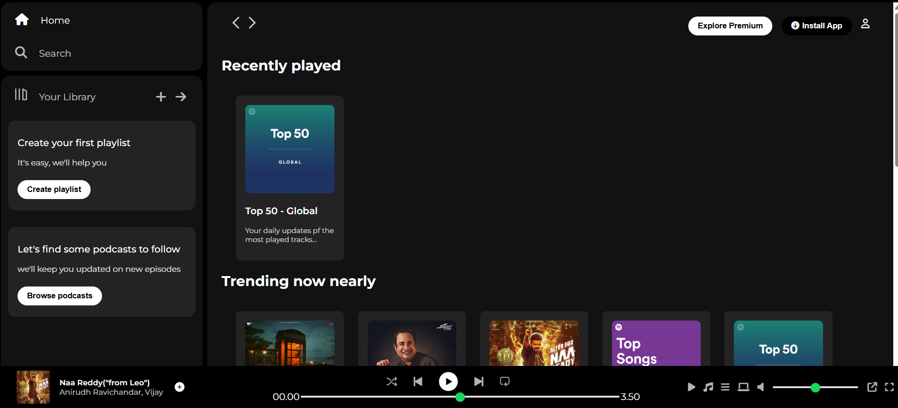

# 🎵 Spotify Clone (HTML & CSS Only)

This is a simple **Spotify Clone** built using **HTML** and **CSS**. It replicates the basic look and feel of Spotify's desktop UI. The project is fully static and meant for learning and showcasing front-end design skills.
👉 **Live Demo**: [[spotify-clone.netlify.app](https://spotify-clone.netlify.app)](https://spotify-clone89.netlify.app/)  

## 🚀 Features

- 🎧 Responsive layout inspired by Spotify's desktop app  
- 🎨 Modern and clean UI with CSS Flexbox/Grid  
- 🔲 Sidebar navigation with icons  
- 📃 Playlist section and album art display  
- 📻 Footer music control panel (static)

> 
## 🖼️ Screenshots




## 📱 Responsiveness

The layout is optimized for **desktop view**. Future updates may include improved mobile responsiveness.

## 🛠️ Tools & Technologies

- **HTML5**
- **CSS3**
- **Flexbox & Grid**
- **Font Awesome (for icons)**


1. Clone or download this repository:
   ```bash
   git clone https://github.com/your-username/spotify-clone.git


